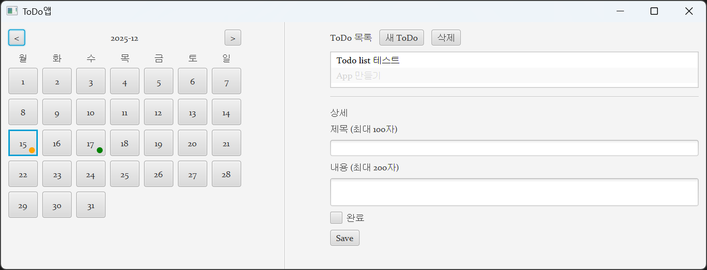

# ToDo앱

Windows 11에서 동작하는 JavaFX 데스크톱 ToDo 앱입니다.

## 스크린샷

이 문서는 지금 레포의 작업 흐름(Plan)인 **개발/테스트 → 패키징 → 설치/업그레이드 검증** 순서대로 따라갈 수 있게 정리되어 있습니다.

## 1) 요구사항

### 개발/빌드(이 레포에서 직접 빌드할 PC)
- Windows 11
- JDK 21 (jpackage 포함)
  - `JAVA_HOME` 설정은 권장(필수는 아님: `run.ps1`/`test.ps1`가 자동 탐지)

### 설치본 실행(생성된 MSI/app-image를 실행할 PC)
- Windows 11
- 보통 JDK 설치는 필요 없습니다(패키지에 런타임 포함)

## 2) 개발 실행 / 테스트

### 가장 단순한 방법(Maven Wrapper)
- 테스트: `./mvnw.cmd test`
- 실행(개발용): `./mvnw.cmd spring-boot:run`

### (권장) VS Code 터미널용 스크립트
VS Code 터미널에서 `JAVA_HOME/Path`가 안 잡혀도, 설치된 JDK 21을 자동으로 찾아서 임시로 설정한 뒤 실행합니다.
- 테스트: `./test.ps1`
- 실행: `./run.ps1`

## 3) 데이터 저장 위치
- 개발 실행(`run.ps1` / `spring-boot:run`): 프로젝트 폴더 하위 `./data/`
- 설치본(MSI/app-image): 사용자 폴더 하위 `%LOCALAPPDATA%\TodoApp\data\`

### 제거(언인스톨) 시 데이터 정책
- 기본값: 앱 제거 후에도 `%LOCALAPPDATA%\TodoApp\data\` 데이터는 남습니다(업데이트/재설치 시 데이터 보존 목적)
- 완전 삭제: 앱 제거 후 `%LOCALAPPDATA%\TodoApp\data\` 폴더를 수동 삭제

## 4) 배포(패키징)

### ZIP / app-image (WiX 불필요)
- ZIP: `./package.ps1 -Type zip`
- app-image: `./package.ps1 -Type app-image`

### MSI (설치형, WiX 필요)
MSI를 만들려면 빌드 머신에 **WiX Toolset(3.x)** 이 설치되어 있어야 합니다(candle/light).

- MSI 생성(기본): `./package.ps1 -Type msi`
- 테스트 스킵: `./package.ps1 -Type msi -SkipTests`
- 버전 지정: `./package.ps1 -Type msi -Version 1.0.2`

산출물 위치:
- `target/installer/`

## 5) 설치/업그레이드(덮어설치) 검증 절차
MSI 업그레이드가 동작하도록 `package.ps1`는 고정된 `--win-upgrade-uuid`를 사용합니다.

1) v1.0.0 MSI 생성: `./package.ps1 -Type msi -Version 1.0.0`
2) 생성된 `TodoApp-1.0.0.msi` 설치
3) 앱 실행 → ToDo 몇 개 추가(데이터 생성)
4) v1.0.1 MSI 생성: `./package.ps1 -Type msi -Version 1.0.1`
5) `TodoApp-1.0.1.msi`를 기존 설치 위에 설치(덮어설치)
6) 앱 재실행 → 기존 ToDo 데이터 유지 여부 확인

## 6) UX(동작 요약)
- 좌측: 월간 캘린더(할 일 있는 날짜에 동그라미 표시: 미완료=주황, 전부 완료=녹색)
- 우측 상단: 선택 날짜의 ToDo 제목 리스트(완료 항목은 하단 + 밝은 회색)
- 우측 하단: 상세 편집(제목/내용/완료) 후 `Save`를 눌러야 저장
- `삭제`는 즉시 삭제

## 7) 트러블슈팅(자주 막히는 지점)
- MSI 생성이 안 되면: WiX Toolset 설치 및 candle/light 인식이 필요합니다. 이 프로젝트의 `package.ps1`는 WiX 설치 경로를 자동 탐지해 임시로 PATH에 추가합니다.
- 설치본에서 DB 권한 문제가 나면: 데이터는 `%LOCALAPPDATA%\TodoApp\data\` 아래에 저장되도록 되어 있습니다.
